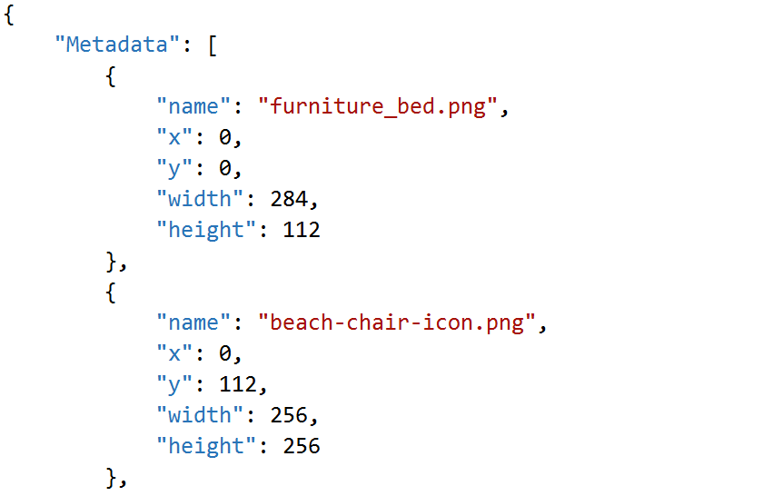
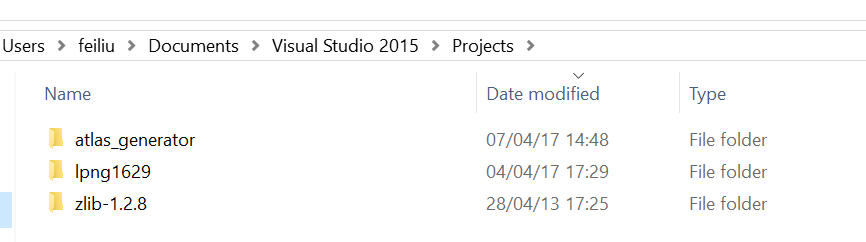

# Texture Atlas Generator
This cross-platform(Windows and Linux) command line texture atlas generator reads .png files from a given folder and outputs a texture atlas png file and its metadat json file.

## Algorithm
This application uses Binary Tree Bin Packing Algorithm, Dynamic Growing Rectangle version. 
Instead of trying to guess the optimal width and height for packing all of our images into, we start with a small canvas, just big enough for the first image, and then grow the canvas towards to right side or to down side when there is not enough room for the next image. With this dynamic growing 
algorithm the unused area is very minimized.
http://codeincomplete.com/posts/bin-packing
 
Before packing, images are sorted by their max side, max(width, height) in descendent order, so the one who has largest side get packed first, this is a proven mechanism to achieve the most pleasing square-ish result and minimal whitespace.

## Usage:
On Windows:  _atlas_generator.exe <image folder>_   
On Linux:    _./atlas_generator <image folder>_ 

If image folder path contains space, please put the path in double.

## Output: 
The texture atlas png and its metadat json file will be generated in the working directory.  

The generated json file will have a format like this:  

## Building Instructions:
### On Windows: 
First compile the libpng and zlib as Static Library for Visual Studio.  

The steps I compiled libpng and zlib as Static Library for Visual Studio 2015 x86 Release version:  
- Download the source _libpng-1.6.29.zip_ and _zlib-1.2.8.zip_  
- Unzip in Visual Studio Projects folder (‘*atlas_generator*’ project also located here) _Documents\Visual Studio 2015\Projects_  
  

- Start Visual Studio 2015,open the solution file _vstudio.sln_ in _Documents\Visual Studio 2015\Projects\lpng1629\projects\vstudio_  
Note: Click a source file in zlib project, be sure you can open it, the lpng1629 vstudio project bunds its zlib project to version zlib-1.2.8.  
- Open the Solution _vstudio_’s Properties. Set all of the fields shown to “Release”.   
- Open _zlib_ project’s Properties.
  - Set the configuration type to _Static library (.lib)_.  
  - Set the Runtime Library to _Multi-Threaded (/MT)_.  
  - Set the Target Machine _x86_.  
  - On the Librarian -> Command Line section copy the output file name: _“C:\Users\feiliu\Documents\Visual Studio 2015\Projects\lpng1629\projects\vstudio\Release\zlib.lib”_.   
- Open _libpng_ project’s Properties.
  - Set Additional Dependencies to the output file nameyou just copied: _C:\Users\feiliu\Documents\Visual Studio 2015\Projects\lpng1629\projects\vstudio\Release\zlib.lib_   
  - Set the Link Library Dependencies to Yes.   
  - Set the configuration type to Static library (.lib).  
  - Set the Runtime Library to Multi-Threaded (/MT).   
  - Set the Target Machine x86.     

Then, open ‘*atlas_generator*’ project’s Properties  
- Add in Additional Include Directories:   
  _..\..\lpng1629_; *..\thirdparty_common\include; thirdparty_win\include*; _src_;  
- Add in Additional Libraries Directories:    
  _..\..\lpng1629\projects\vstudio\Release_;  
- Add in Linker Input:   
  _libpng16.lib_; _zlib.lib_;  
  Finally build ‘*atlas_generator*’ project Release with x86.   

### On Linux: 
Use system package manager to install _libpng_ and _zlib_:    
_sudo apt-get install libpng12-dev_    
The _zlib_ will be installed automatically when you install _libpng12-dev_.  

Build ‘*atlas_generator*’ project: On command line in ‘UbuntuProject’ folder run:  _make_  

## Third Party Dependencies:  
They are: _libpng_, _zlib_, _dirent_, and _rapidjson_.  
- _libpng_, _zlib_ is used for reading and writing png both for Windows and Linux.  
- _dirent_ is used on Windows for reading folder(Linux has ‘_dirent_’).  
  It’s a header only library, it’s in folder _VisualStudioProject\thirdparty_win\include_.  
- _rapidjson_ is used for output json both for Windows and Linux.  
  It’s a header only library, it’s in folder *thirdparty_common\include*.  

